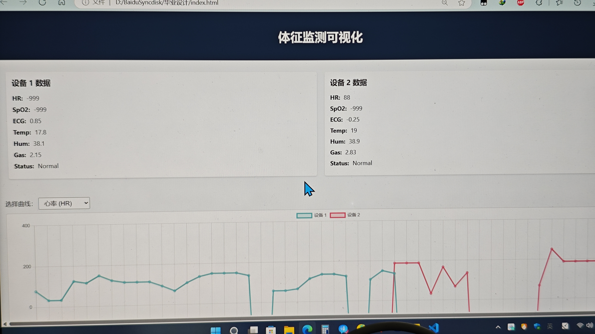

# 基于LoRa的生命体征监测系统

2025年的简单毕设
硬件：  ESP32-S3（主控）  MAX30102（心率、血氧）  DHT22（环境温湿）  ATK-LoRa-01（LoRa模块）  AD8232（心电）  MQ-7/MQ-2（环境气体）  MPU6050（陀螺仪检测跌倒）  软件：  VScode+Platform（C++）  MQTT接收、转发数据  可视化网页是HTML5订阅MQTT数据
===============================================================
系统整体图

系统功能实现
采集端-发送端

接收端

可视化界面（HTML5+MQTT）

